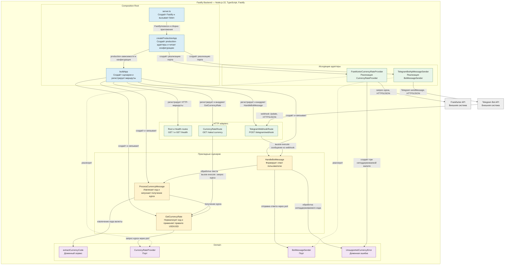

# C4 Level 3 — Component

Диаграмма раскрывает внутренние компоненты Fastify Backend, направление вызовов и применение Dependency Inversion между application-логикой и внешними API.

Прикладные сценарии обращаются к `CurrencyRateProvider` и `BotMessageSender`, а не к Frankfurter или Telegram напрямую. Конкретные исходящие адаптеры реализуют эти порты и связываются со сценариями только в Composition Root; так диаграмма отражает Dependency Inversion и сохраняет независимость бизнес-логики от Fastify и внешних API.
