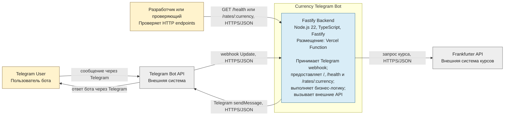

# C4 Level 2 — Container

Диаграмма показывает единственный развёртываемый контейнер системы, его ответственность и взаимодействие с пользователями и внешними API.

Fastify Backend является одним контейнером, потому что маршруты, прикладная и доменная логика, а также исходящие адаптеры выполняются в одном процессе и развёртываются вместе как одна Vercel Function. В проекте нет отдельных frontend-приложений, баз данных или независимо развёртываемых сервисов.
