# C4 Level 1 — System Context

Диаграмма показывает место системы Currency Telegram Bot среди пользователей и внешних систем, не раскрывая её внутреннее устройство.

```mermaid
flowchart LR
    user["Пользователь Telegram<br/>Отправляет код валюты и читает ответ"]
    telegram["Telegram Bot API<br/>Внешняя система обмена сообщениями"]
    bot["Currency Telegram Bot<br/>Рассчитывает и отправляет курс валюты относительно USD"]
    frankfurter["Frankfurter API<br/>Внешний источник валютных курсов"]

    user -->|"сообщение через Telegram"| telegram
    telegram -->|"webhook Update, HTTPS/JSON"| bot
    bot -->|"запрос курса, HTTPS/JSON"| frankfurter
    bot -->|"Telegram sendMessage, HTTPS/JSON"| telegram
    telegram -->|"ответ бота через Telegram"| user

    classDef person fill:#fff3cd,stroke:#8a6d3b,color:#222;
    classDef system fill:#d9edf7,stroke:#31708f,color:#222;
    classDef external fill:#eeeeee,stroke:#666666,color:#222;
    class user person;
    class bot system;
    class telegram,frankfurter external;
```

Пользователь взаимодействует только через Telegram. Currency Telegram Bot принимает webhook, получает внешний курс у Frankfurter API и возвращает результат через Telegram Bot API. Платформа размещения не показана, поскольку она не участвует в бизнес-взаимодействиях этого уровня.
